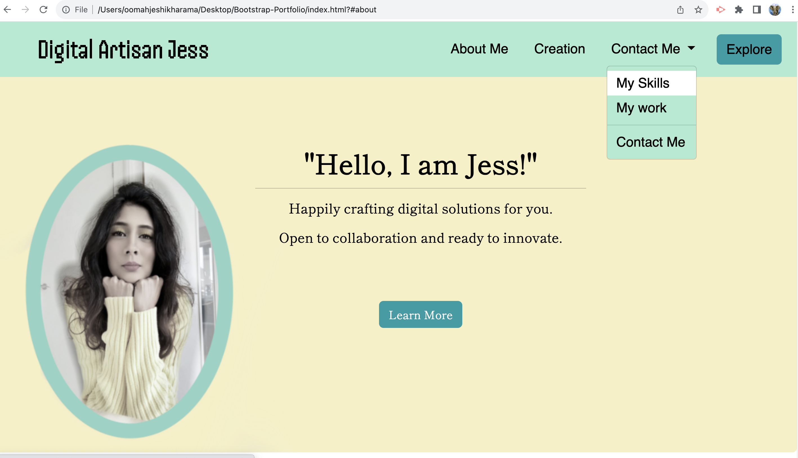
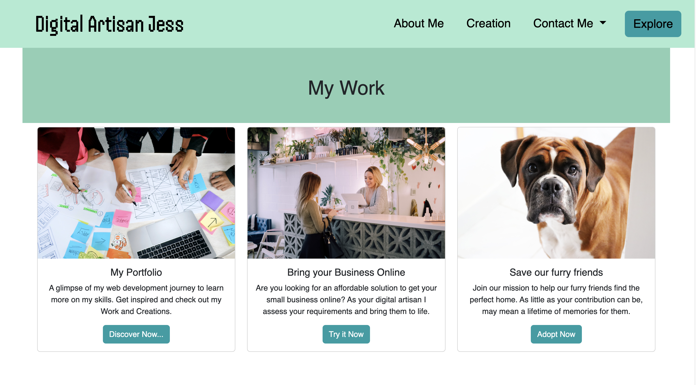
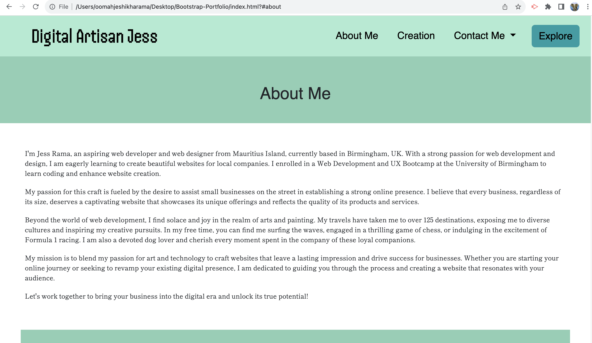
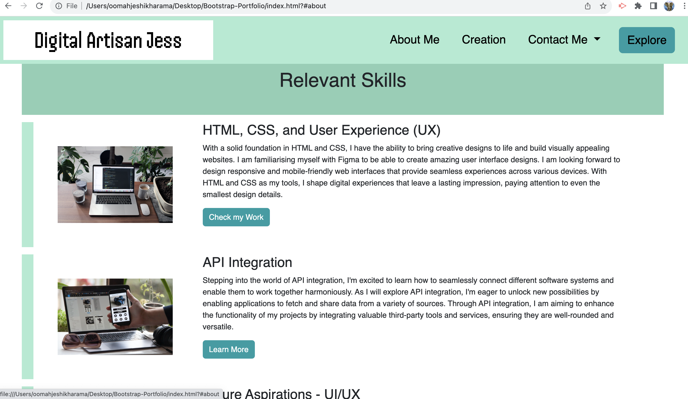
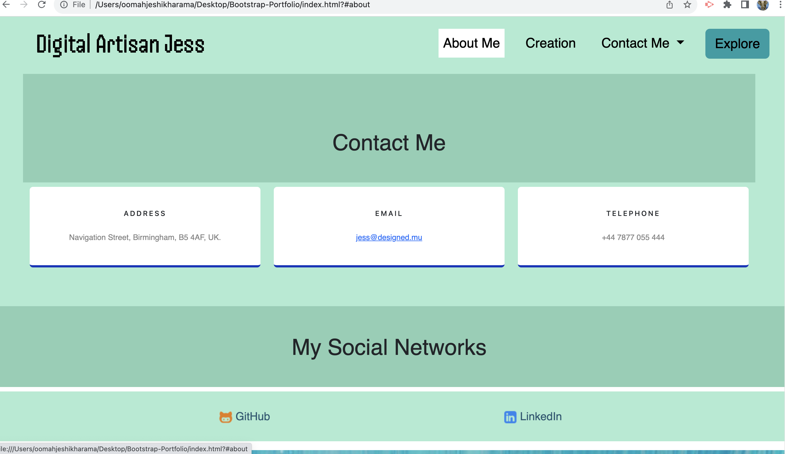
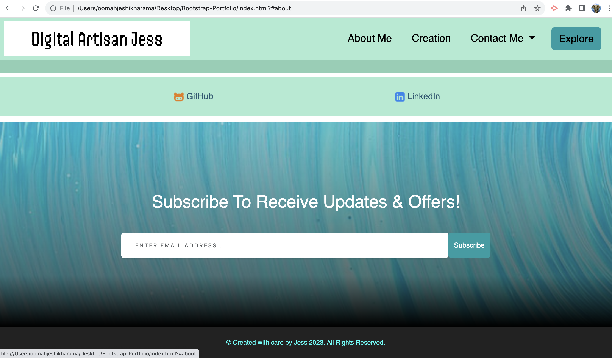

# Bootstrap Portfolio

Welcome to my Bootstrap-powered portfolio website!

This project is a part of my web development journey, where I have recreated my portfolio site using Bootstrap. The portfolio showcases my work, skills, and provides information about me. I have followed the guidelines of the instructions given in the module challenge to construct a website with the help of Bootstrap templates. Creating this portfolio was an enriching experience that pushed me to learn and grow. Throughout the process, I encountered various challenges and spent countless hours refining and perfecting the design and functionality. 

## Page Sections

- Navigation Bar (#navigation-bar)
- Hero Section (#hero-section)
- Work Section (#work-section)
- Skills Section (#skills-section)
- About/Contact Section (#about/contact-section)
- CTA (Subscribe to receive updates)
- Footer (#footer)

## Navigation Bar

The navigation bar includes links to different sections of the portfolio:
- About Me
- My Work
- Contact Me
- Explore button to quickly navigate to the Work section

## Hero Section

The hero section features a jumbotron with my picture, name, and a brief introduction. It serves as an attractive introduction to the portfolio.

## Work Section

The work section showcases some of the projects I have worked on. Each project is displayed using Bootstrap cards, providing a description and a link to the project such as my GitHub profile, my previous portfolio website and a pet organisation.

## Skills Section

In the skills section, I've listed the skills that I have acquired and expect to learn during my web development bootcamp.

## About

The About Me section provides information about me, my passion for web development, and my interests outside of coding. It's a personal touch to connect with visitors.

## Contact Section/ Social Networks

The Contact Me section includes my address, email, and telephone number, allowing visitors to reach out, for which I have used the Bootstrap cards format and and provides links to my social networks (GitHub and LinkedIn).

## CTA (Subscribe to receive updates)

Call to action button to push audience to Subcribe to my marketing emails with a functional Modal button. 

## Footer

The footer contains copyright information.

## Tools and Resources Used

• Bootstrap: Offered a collection of pre-designed components, responsive cards, and CSS styles that helped streamline the development process. By utilising Bootstrap, I was able to create a visually appealing and responsive portfolio that works seamlessly across different devices.

• Google Fonts: Custom fonts from Google Fonts have been integrated into the project to enhance typography and visual appeal.

• Unsplash: High-quality stock images from Unsplash have been used to create visually engaging content on the portfolio page.

• Coolors.co: The color palette for this project was selected using Coolors.co, ensuring a harmonious and cohesive visual experience.

• Streamline Icons: Icons for the navigation bar and Let's Get in Touch sections has been sourced from Streamline Icons, providing a professional touch to the design.

• Mentor Support: Drew and classmates have provided invaluable assistance throughout the project, offering guidance and clearing doubts whenever needed.

• GitHub Repository: This project's source code and related files are hosted on GitHub in a public repository. GitHub serves me as a version control system, allowing me to track changes made to the codebase, collaborate with others, and manage the development of the project.

• VS Code: Throughout the development process, VS Code proved to be an invaluable code editor.

## Struggles Overcome

I estimate that I spent around 15 hours working on this project, from planning and structuring the layout to refining the styling and ensuring a smooth deployment. These hours were filled with learning, problem-solving, and the satisfaction of seeing my portfolio come to life.

While the journey was challenging at times, the sense of accomplishment I feel now is incredibly rewarding. This portfolio is a testament to my dedication and commitment to honing my skills as a web developer.

- Responsive Design: Ensuring that the portfolio looks great on all screen sizes and devices was a challenge. I spent considerable time fine-tuning the responsive aspects to ensure a seamless user experience.

- Navigation Bar Customization: Customizing the navigation bar to match my vision took some trial and error. I explored Bootstrap documentation and experimented with different styles before achieving the desired look.

- Card Layout: Designing and implementing the card layout for the work section required careful consideration of the content and visual appeal. Balancing aesthetics and information was a creative challenge.

## License

This project is licensed under the MIT License.

## Deployment - Useful Links to facilitate viewing of project

1. The URL of the GitHub repository:
https://github.com/Jeshikha/Bootstrap-Portfolio

2. The URL of the functional, deployed application on GitHub Pages:

3. The URL of the previous Portfolio Application used as reference to replicate bootstrap features:
https://jeshikha.github.io/my-portfolio/

## Screenshots of Page Layout

The following images shows the web application's appearance and functionality:
The following images shows the web application's appearance and functionality:

